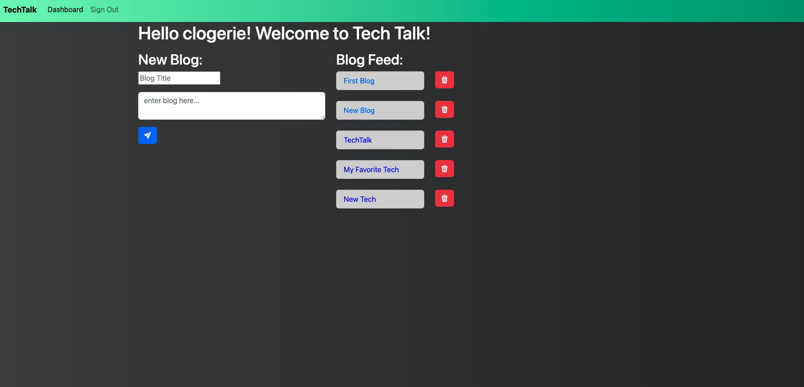

# TechTalk

## Table of Contents
* [Description](#description)
* [Preview](#preview)
* [Installation](#installation)
* [Contributing](#contributing)
* [Questions](#questions)

## Description

This is an application called TechTalk that is similar to a Wordpress site, where developers can publish their blog posts and comment on other developers’ posts as well. TechTalk follows the MVC paradigm in its architectural structure, using Handlebars.js as the templating language, Sequelize as the ORM, and the express-session npm package for authentication. It is also deployed on Heroku.

## Preview

The following image shows a mock-up of the generated HTML’s appearance and functionality:

 
Heroku Deployment - (https://morning-lake-99145.herokuapp.com/)

## Installation 
The user should clone the repository from GitHub and then install Node. The user shoulder also create a database and then seed it. The depencies for this application include: bcrypt, connect-session-sequelize, dotenv, express, express-handlebars, express-session, mysql2, and sequelize. 

## Contributing 
Contributors should reference the installation section.  

## Questions
Please email me at carl.logerie92@gmail.com with any questions.